My team was recently engaged by a client (**HackMe**) to perform a black-box external penetration test. The objective was simple – see how susceptible the organization is from an external point of view and test the effectiveness of the security controls that are managed enterprise-wide. As such, asides, the company name, we were given “ZERO” information.

The following details illustrate how we embarked upon this assessment which resulted in…

Well, read on…

#### OSINT 101

We kicked off with some Open Source Intelligence (OSINT) 101 :). There are quite a number of open source intelligence tools – to assist in gathering emails, subdomains, hosts, employee names, etc from different public sources like search engines and shodan. [There is an exhaustive list of such awesome tools here](https://github.com/jivoi/awesome-osint).

Using quite a few open source intelligence tools, we obtained publicly available documents relating to the organization.

With Google dork to the rescue, we ran some basic search strings: `site:*.hackme.com ext:xls OR ext:docx OR ext:pptx` . Of course, our aim was not to tirelessly search for documents. Rather, our objective was to understand the organization’s naming schema by examining the metadata of the documents which is found in the "properties section" of the document (most especially Microsoft Word, PowerPoint and Excel). One can also use [FOCA](https://www.elevenpaths.com/labstools/foca/index.html) for this.

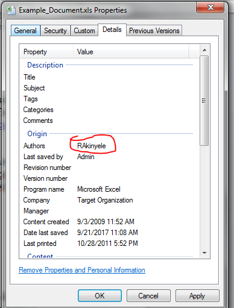

From this, I noticed that employees emails followed a particular naming convention – the first letter of the firstname + surname @ domain.com i.e. `rakinyele@hackme.com`.

Armed with this knowledge, we forked out from LinkedIn the list of all current employees of **HackMe** using the following google dork syntax:

`site:linkedin.com -inurl:dir "at **HackMe**" "Current"`. A typical example is shown below using Google Inc as a reference company.

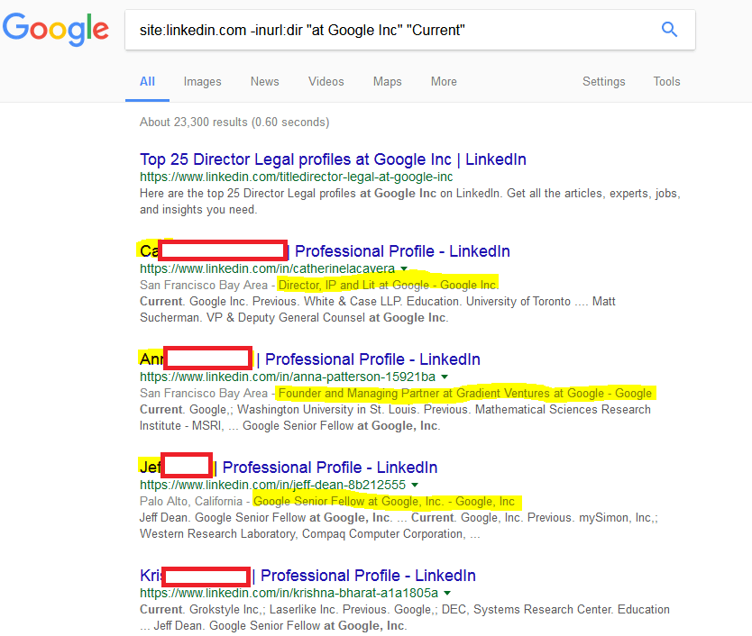

By hacking a script to automate the process, we copied out the firstnames, lastnames and the roles of the current employees of **HackMe**. A tiring approach is to manually crawl through the google pages in search for these names and role or one could also use GoogleScraper:

`GoogleScraper -m http –keyword "site:linkedin.com -inurl:dir 'at **HackMe**' 'Current'" –num-pages-for-keyword 3 –output-filename output.json`

…and then the results:

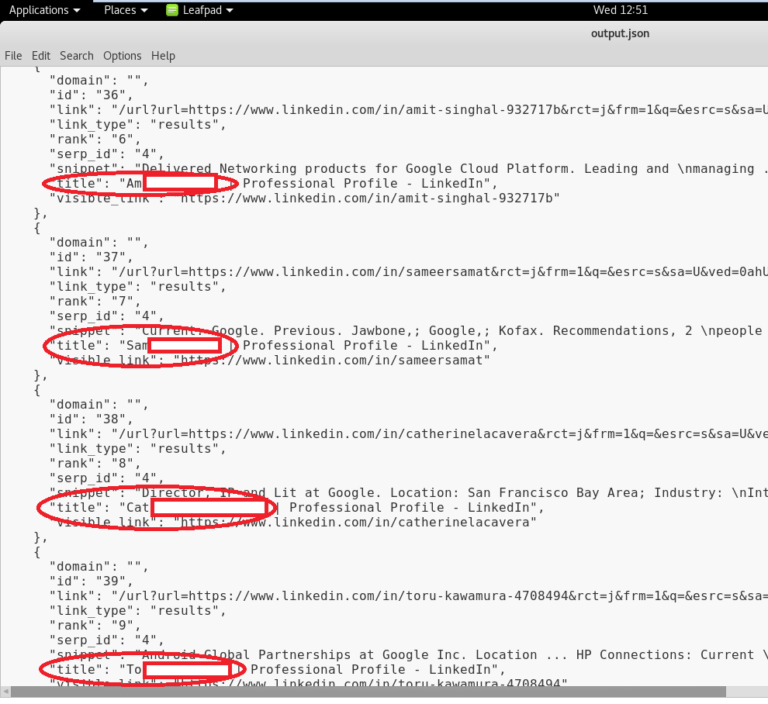

Again, I leave the possibilities to your imagination – but you can easily convert this to a .csv file using https://json-csv.com/ or any other converter that works for you.

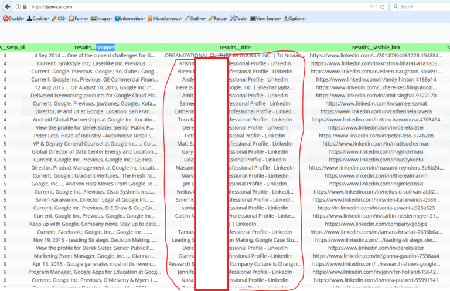

and then using your favorite word processor (word merge, notepad++, etc) or some good scriptfu skills, merge the firstname + lastname – to form your email list.

#### Now it’s time to feed our target list a payload…

Since we are simulating a black-box external attack, we decided (just like what an attacker would do) to gain code execution using malicious payloads. As such, we thought of creating a payload and sending it via emails to employees of **HackMe**.

We also know that it is a common practice for some file type/extensions to be blocked by the organization’s email filters – to limit exposure to risk.

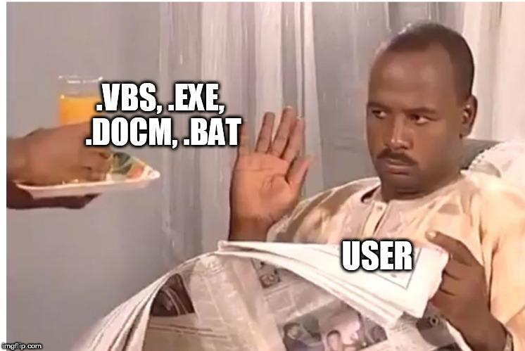

This then brings us to using [Koadic C3 COM Command & Control](https://github.com/zerosum0x0/koadic), a very decent framework just like your Meterpreter or Empire.What made it really stand out asides the beautiful interface is that it allows one to dump hashes, download/upload files, execute commands, bypass UAC, scan local network for open SMB, pivot to another machine, load mimikatz and a lot more.

So we ran Koadic and set the necessary variables – using the "stager/js/mshta " module (serves payloads in memory using MSHTA.exe HTML Applications)

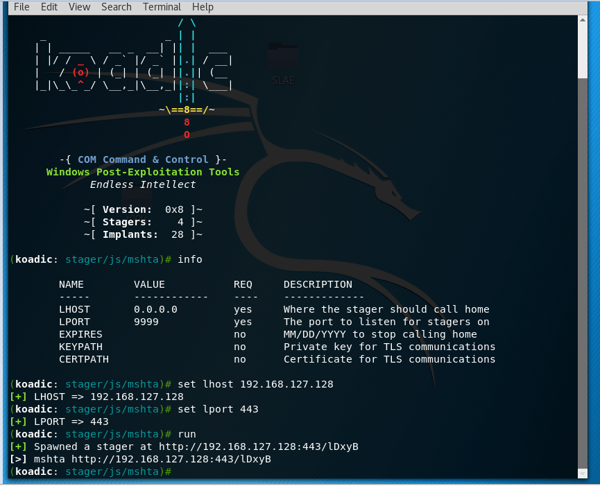

The result was a spawn of our HTA payload url as evidenced in the screenshot above. However, we need our targets to execute our payload as “mshta payload_url". In recent years, HTA payloads have been used as a web attack vector and also, to drop malware on a victim’s PC. Now we need to get this payload past our victim’s numerous defenses.

Here comes the tricky part – we needed a way to have the victim run “mshta payload_url" without our payload being spawned as a child process of mshta.exe – as we suspect this organization’s blue team may flag this.

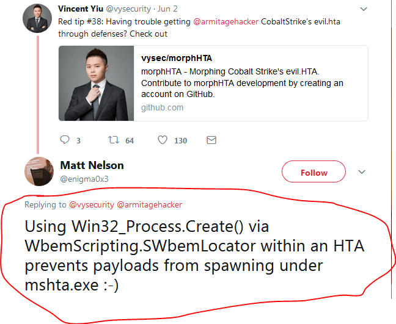

Thankfully, we saw the tip on the left from Matt Nelson and interestingly, the team at NCCgroup have this implemented in [Demiguise](https://github.com/nccgroup/demiguise/).

So here is our final payload saved as a .hta file.

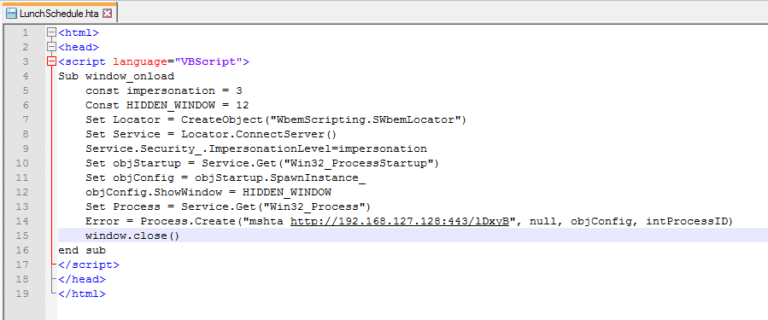

The next step typically is to send our .hta payload as an embedded OLE object.

The intended attack scenario was:

Send a Microsoft word document with our .hta payload embedded as an OLE object.

Get the user to open the word document and the embedded OLE object.

This spawns a new process and we get a shell access into our victim’s PC.

Now we get to the interesting part, we need our victim to open the Microsoft word document and our payload.

 To do this, we need a very compelling story – just because users are getting smarter. So we headed back to doing more recon.

#### …and more recon

We need to know more about the target organization’s environment – specifically employees. The question we kept asking ourselves – what would interest the employees?

Where else to get this information than Glassdoor , a platform that gives you inside scoop on companies with employee reviews about salaries, benefits, pros and cons of working with the company.

After poring through reviews of the target organization on Glassdoor, we found some common themes:

1. Some employees felt mobility was a challenge as the office is quite a long distance from residential locations.

2. Employees love the organization because they get free lunch.

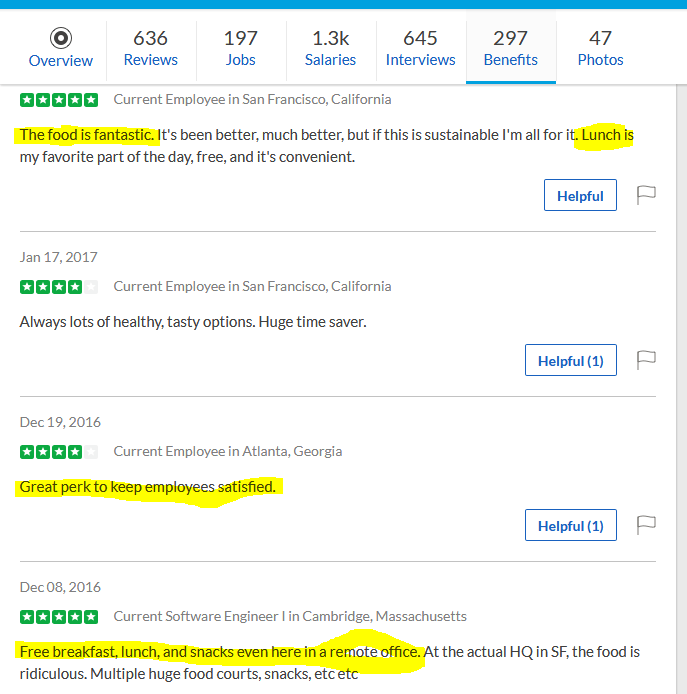

#### But Wait!

Like the old saying goes, the fastest way to a man's heart is through his stomach. So what better way to get the employees to open our payload embedded word document?

Send them an email – telling them there is a change in the FREE LUNCH menu starting from tomorrow.

Rather than send a random phishing email to employees that could be spotted easily, we decided a seemingly genuine email would be ideal complete with **HackMe** email signature while observing the organization email culture. Now, how do we make our email more believable? By sending an email to Customer service/Help Desk with a service request and observing the email signature in the response.

#### … recon again???

We headed back to Linkedin, to look for the name of either the HR Manager, Logistic Manager or Admin Manager (whichever is appropriate) of **HackMe**. We carefully crafted an email signature with the name we selected.

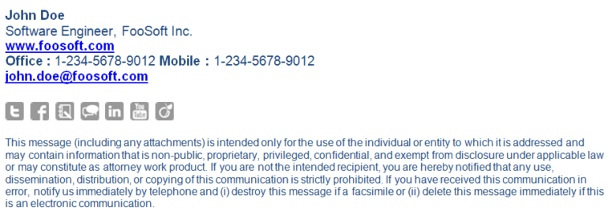

We are halfway through sending our payload now. Have some patience and read on…

#### …time to send our payload

From the metadata recon done earlier, we could tell what our target organization’s document headers and footers looked like. I then created a new word document like the one shown below with a splitting image of **HackMe** document template with appropriate headers/footers.

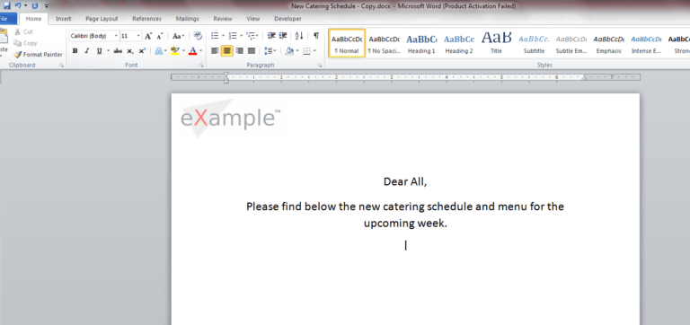

…and then we embedded our .hta as an OLE object. Microsoft Word Document >> Insert >> Object >> Package. We changed the icon to Microsoft Word’s icon and also the caption to reflect our message.

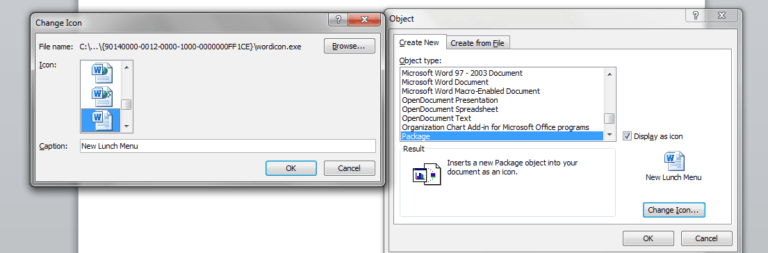

Change the icon to Microsoft Word’s icon and also, change the caption to reflect your message.

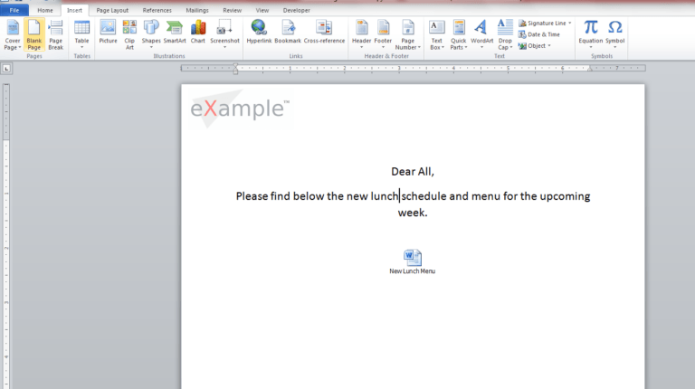

#### Don’t forget the antivirus!!!

To check the AV detection rate of our payload – and to see if it will be flagged as malicious by **HackMe** antivirus solution (if any), we did a quick AV scan on nodistribute.com. Nodistribute.com was used because according to them, they don’t distribute payload samples to AV companies. We scanned both the maldoc and the .hta file as well.

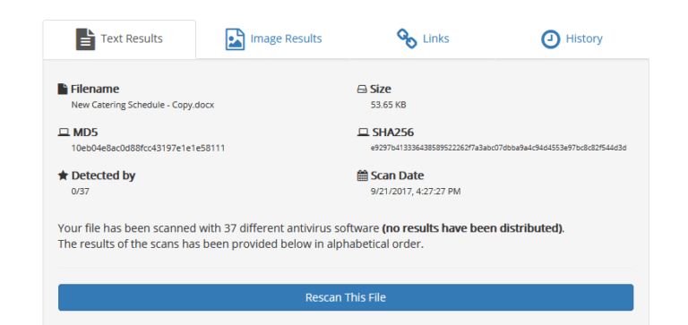

AV Scan of our .hta payload (0 detections)

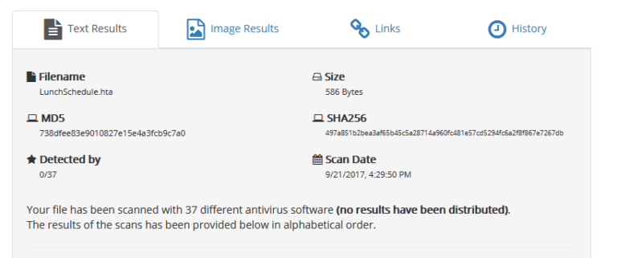

#### …it's time to send our email

If the target org does not have SPF, DKIM and DMARC configured, one can easily spoof the HR Manager, Logistic Manager or Admin Manager’s email address. In this case, I created a Gmail account (yes, gmail works too) using the Logistic Manager's first name and last name – and then spiced it up with his signature which was gotten earlier.

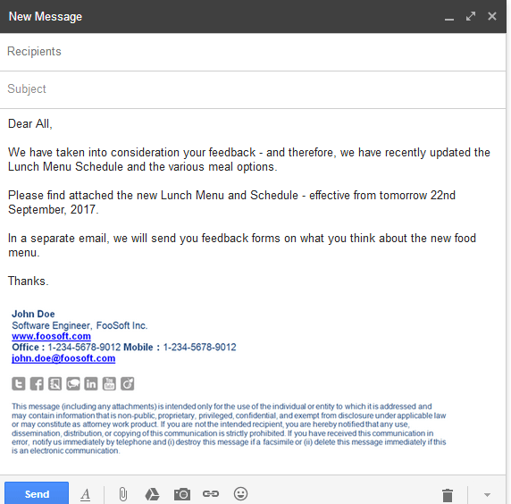

#### Let the shells in

Shortly after sending the email, within a period of about 3 minutes, we had at least 30 shell connections! W00t!!!

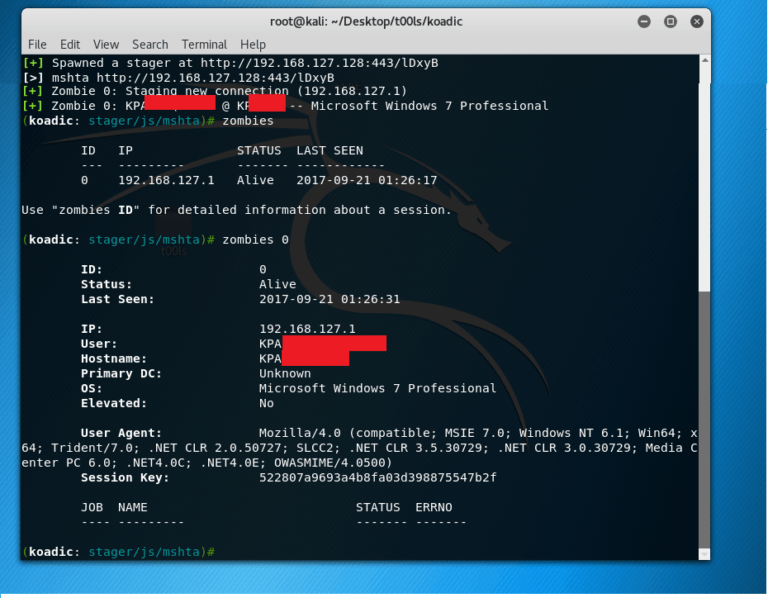

#### What next?

The rest they often say is history. From here-on, using the mimikatz modules, we escalated privileges, dumped hashes, scanned the local network of **HackMe**, pivoted into other PCs, browsed the target’s file systems and even became domain admins etc.

#### In conclusion

All in all, this was a very fun engagement. Whilst it may take an attacker a month/2months/a year of dedication to break into an organization – through a loophole at the infrastructure level. It can be fairly easy for one to gain access by exploiting the human factor.

"Once you understand your target environment, devising a creative means in gaining access to the environment becomes fairly easy”.

The moral of the exercise is: Recon, recon and more recon – for a wise man once said “Give me six hours to chop down a tree and I will spend the first four sharpening the axe".

#### About the Author:

Rotimi Akinyele - Rotimi is an experienced Cybersecurity, IT Governance, Risk, and Compliance (GRC) professional. He is an Assistant Manager, Cybersecurity at BDO UAE and has successfully delivered cybersecurity projects across various regions in the Financial Services, Telecoms, Oil & Gas, FMCG, Govt. & Regulatory industries.

